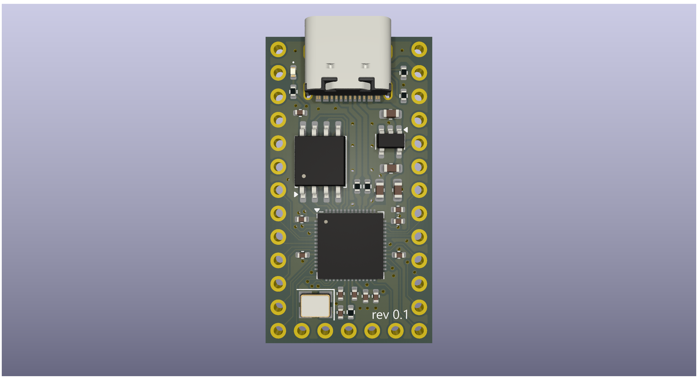

# pro_smolcro
Some requirements for this board:
1) Should be a replacement for a pro micro, therefore have the same pinout and should have the same dimensions
2) Have a 5V out from the usb that could be used to either power the other microcontroller or to power some 5v LEDs for better efficiency
3) RP2040 based board with 16MB of flash memory
4) Look into how to detect VUSB from QMK, so i can make sure it works

